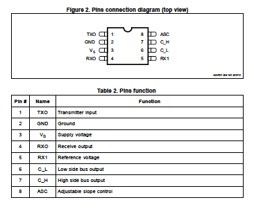
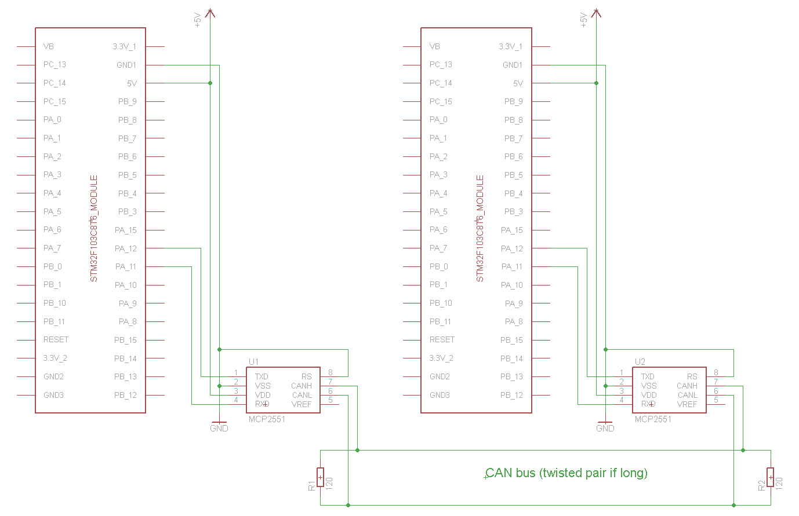
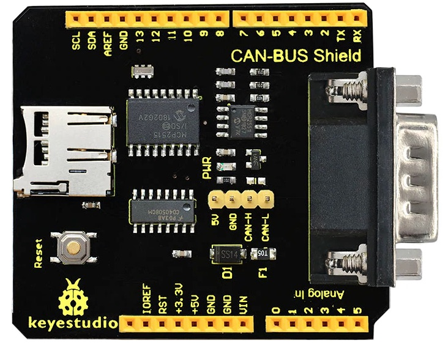

# CAN Bus :: Setup instructions

L9616 is compatible with the [NXP TJA1042](https://www.nxp.com/docs/en/data-sheet/TJA1042.pdf) CAN driver.

The TJA1042 driver for RIOT should be added as a module.

## Wiring with 2 Nucleo F446RE + 2 L9616

The pinout of the L9616 is belong:

The pinout of the L9616 (SOC8) adapter is: 

		        VREF			RXD	--> D15 (Grey)
		        CANL (Yellow)	VDD --> 5V	(Red)
		        CANH (Green)	VSS	--> GND	(Black)		
				GND <-- RS		TXD --> D14	(Purple)
		     			ARIES	
	 

[see pinout Nucleo F446RE](https://os.mbed.com/platforms/ST-Nucleo-F446RE/).

The Nucleo F446RE had 2 CAN ports:
* CAN1 (CAN1_RD is on D15, CAN1_TD is on D14) --> can0 on "can list"
* CAN2 (CAN2_RD is on D4, CAN2_TD is on D10)  --> can1 on "can list"

## Wiring with 1 Nucleo F446RE CAN1 + 1 Nucleo F767ZI CAN1

* [nucleo-f767zi](https://github.com/RIOT-OS/RIOT/tree/master/boards/nucleo-f767zi) had 1 CON port.

CAN1 Pins are CN9-25 (PD0) for CAN_RX (grey) and CN9-27 (PD1) for CAN_TX (purple). Connect GND and 5V to the board.

## Wiring with the Nucleo F411RE and Keyestudio CAN-BUS Shield

TODO

* [Keyestudio CAN-BUS Shield MCP2515](https://fr.aliexpress.com/item/32998255055.html) [wiki](https://wiki.keyestudio.com/KS0411_keyestudio_CAN-BUS_Shield)

