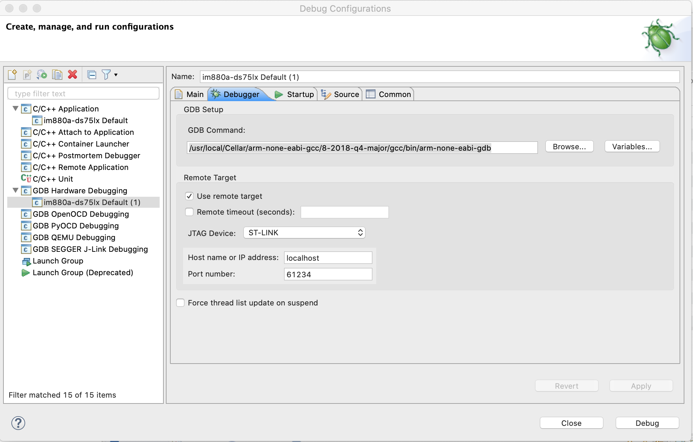

# Configuration du projet avec Eclipse CDT

Lire https://github.com/RIOT-OS/RIOT/wiki/Using-the-Eclipse-IDE-for-C-and-CPP-Developers%2C-Howto

Importer le projet avec `File > Import > C/C++ > Existing Code as Makefile Project`
		
	
Dans `Properties > C/C++ Build > Environment`
* Ajouter à `PATH` `/bin:/usr/bin:/usr/sbin:/sbin:/usr/local/bin`
* Ajouter à `RIOT_BASE` `/Users/donsez/github/RIOT-OS/RIOT`
	
Dans `Properties > C/C++ Build` (Pour MacOS)
* Ajouter à `Build command` : `gmake`
	
Dans `Properties > C/C++ Build > Tool Chain Editor`
* Sélectionner `Cross GCC`
	
Dans `Properties > C/C++ General > Paths and Symbols` puis `Import Setting`
* Ajouter `eclipsesym.xml` généré au moyen de `gmake BOARD=im880b eclipsesym`
* Répérer le répertoire d'installation de `arm-none-eabi` avec `ls -al /usr/local/bin/arm-none-eabi-gcc`
* Ajouter `/usr/local/Cellar/arm-none-eabi-gcc/8-2018-q4-major/gcc/arm-none-eabi/include` aux `includes`
	

Pour le Debug `/usr/local/Cellar/arm-none-eabi-gcc/8-2018-q4-major/gcc/bin/arm-none-eabi-gdb`



Répérer les chemins vers le serveur GDB et le programmeur STLink

Dans `Run > External Tools > External Tools Configurations...`, ajouter une nouvelle configuration `ST-LINK_gdbserver` avec 
* `Location` : `/Applications/STM32CubeIDE.app/Contents/Eclipse/plugins/com.st.stm32cube.ide.mcu.externaltools.stlink-gdb-server.macos64_1.3.0.202002181050/tools/bin/ST-LINK_gdbserver`
* `Arguments` : `-d -v -cp /Applications/STM32CubeIDE.app/Contents/Eclipse/plugins/com.st.stm32cube.ide.mcu.externaltools.cubeprogrammer.macos64_1.3.0.202002181050/tools/bin/`
* `Working Directory` : `/Applications/STM32CubeIDE.app/Contents/Eclipse/plugins/com.st.stm32cube.ide.mcu.externaltools.stlink-gdb-server.macos64_1.3.0.202002181050/tools/bin`
	
	
> Le `ST-LINK_gdbserver` peut être lancer d'un terminal avec la commande `/Applications/STM32CubeIDE.app/Contents/Eclipse/plugins/com.st.stm32cube.ide.mcu.externaltools.stlink-gdb-server.macos64_1.3.0.202002181050/tools/bin/ST-LINK_gdbserver -d -v -cp /Applications/STM32CubeIDE.app/Contents/Eclipse/plugins/com.st.stm32cube.ide.mcu.externaltools.cubeprogrammer.macos64_1.3.0.202002181050/tools/bin/`


# MacOS
RIOT requière une version 4.x de Make.

GNU Make 3.81 is not supported by RIOT since release 2020.01. Please upgrade your system to use GNU Make 4.% or later..


```bash
make --version
brew install gmake
gmake --version

```
