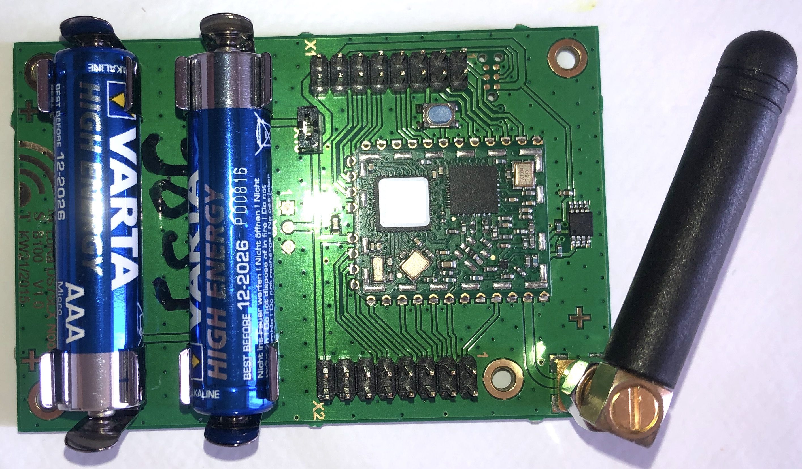

# IMST iM880a Board

## Board
The IMST iM880a board is a simple prototyping board with an IMST IMST iM880a LoRa module and a DS75LX temperature sensor.

<p align="center">

</p>

## Demonstration

The demonstration program reads the temperature from the DS75LX sensor and sends it into an uplink message over a LoRaWAN network. The program prints the payload of the downlink messages. 

## Libraries

Board:
* [boards/im880b](https://github.com/RIOT-OS/RIOT/tree/master/boards/im880b)

Drivers:
* [drivers/ds75lx](https://github.com/RIOT-OS/RIOT/tree/master/drivers/ds75lx)


## Build and flash

Connect the X1 and X2 connectors according to the wiring despicted in the annexes.

By default, the DevEUI, the AppEUI and the AppKey are forged using the CPU ID of the MCU. However, you can set the DevEUI, the AppEUI and the AppKey of the LoRaWAN endpoint into the `main.c`.

Optional : Configure the following parameters into the program file `main.c` : `FIRST_TX_PERIOD`, `TX_PERIOD`, `DR_INIT`, `ADR_ON`, `DEBUG_ON` and `SECRET`.

Register the endpoint into a LoRaWAN network (public or private) using the DevEUI, the AppEUI and the AppKey

Build the firmware
```bash
export RIOT_BASE=~/github/RIOT-OS/RIOT
(cd $RIOT_BASE; git checkout 6bf6b6be6c4723b49f62550a35111e57b7426aa4) 
make binfile
```

```
Connect the board to the STLink according this [tutorial](https://github.com/CampusIoT/tutorial/tree/master/im880a) and then flash the firmware
```bash
export RIOT_BASE=~/github/RIOT-OS/RIOT
make flash-only
```
## Console
Connect the board TX pin to USBSerial port and then configure and start `minicom`.

```bash
ll /dev/tty.*
minicom -s
```

## AppKey

The AppKey can be recovered from the DevEUI (displayed at startup) and the SECRET (flashed into the firmware) with the command lines below:

```
SECRET=cafebabe02000001cafebabe02ffffff                                         
DevEUI=33323431007f1234                                                         
AppEUI=33323431ffffffff                                                        
SHA=$(echo -n $DevEUI$AppEUI$SECRET | xxd -r -p | shasum -b | awk '{print $1}')
AppKey="${SHA:0:32}"
echo $AppKey
```

## Downlink

You can send a downlink message to the endpoint throught your network server.

Downlink payload can be used for
* sending an ASCII message (port = 1)
* setting the realtime clock of the endpoint (port = 2)
* setting the tx period of the data (port = 3)

### Setup
For CampusIoT:
```bash
ORGID=<YOUR_ORG_ID>
BROKER=lora.campusiot.imag.fr
MQTTUSER=org-$ORGID
MQTTPASSWORD=<YOUR_ORG_TOKEN>
applicationID=1
devEUI=1234567890abcdef
```

### sending an ASCII message
```bash
PORT=1
mosquitto_pub -h $BROKER -u $MQTTUSER -P $MQTTPASSWORD -t "application/$applicationID/device/$devEUI/tx" -m '{"reference": "abcd1234","confirmed": true, "fPort": '$PORT',"data":"SGVsbG8gQ2FtcHVzSW9UICE="}'
```

The output on the console is:
```
main(): This is RIOT! (Version: 2020.04-devel-1660-gb535c)
Secret:cafebabe02000001cafebabe02ffffff                                         
DevEUI:33323431007f1234                                                         
AppEUI:33323431ffffffff                                                         
AppKey:f482a62f0f1234ac960882a2e25f971b                                         
Starting join procedure: dr=5                                                   
Join procedure succeeded                                                        
Sending LPP payload with : T: 22.75                                             
Received ACK from network                                                       
Sending LPP payload with : T: 22.75                                             
Data received: Hello CampusIoT !, port: 1                                      
Received ACK from network                                                       
```

### setting the tx period of the data

```bash
PORT=3
mosquitto_pub -h $BROKER -u $MQTTUSER -P $MQTTPASSWORD -t "application/$applicationID/device/$devEUI/tx" -m '{"reference": "abcd1234","confirmed": true, "fPort": '$PORT',"data":"PAA="}'
```
> The new tx period is 60 seconds (3C00)
> The epoch is a unsigned 16 bit-long integer (big endian)

The output on the console is:
```
...
Sending LPP payload with : T: 22.75                                
Data received: tx_period=60, port: 3                                            
Received ACK from network                                                       
```

### synchronizing the realtime clock (RTC) of the endpoint

Chiprstack implements FUOTA which includes the Clock Sync [https://lora-alliance.org/resource-hub/lorawanr-application-layer-clock-synchronization-specification-v100]
https://www.chirpstack.io/application-server/use/fuota/


```
...
[clock] Current RTC time :   2020-05-24 15:03:09                                
[clock] Last correction  : never                                                
[clock] app_clock_send_app_time_req                                             
[clock] Current time:   2020-05-24 15:03:09                                     
[clock] app_clock_process_downlink                                              
[clock] APP_CLOCK_CID_AppTimeAns                                                
[clock] Current time    :   2020-05-24 15:03:10                                 
[clock] Time Correction : 1                                                     
[clock] RTC time fixed  :   2020-05-24 15:03:11                                 
[clock] sent_buffer:                                                            
[clock] app_clock_send_buffer                                                   
[clock] Current RTC time :   2020-05-24 15:03:11                                
[clock] Last correction  :   2020-05-24 15:03:11                                
...
```

> TODO : APP_CLOCK_CID_ForceDeviceResyncReq (0x03) : force the end-device to trigger a clock resynchronization

### Setting the realtime clock (RTC) of the endpoint
```bash

DELTA_EPOCH_GPS=315964800
EPOCH_GPS=$(($(date +%s) - $DELTA_EPOCH_GPS))
v=$(printf "0x%02x\n" $EPOCH_GPS)
v2=$(( (v<<8 & 0xff00ff00) | (v>>8 & 0xff00ff) ))
v2=$(( (v2<<16 & 0xffff0000) | v2>>16 ))
PAYLOAD=$(printf 'fe%08x\n' $v2)
DATA=$(echo $PAYLOAD | xxd -r -p | base64)

PORT=202
mosquitto_pub -h $BROKER -u $MQTTUSER -P $MQTTPASSWORD -t "application/$applicationID/device/$devEUI/tx" -m '{"reference": "abcd1234","confirmed": true, "fPort": '$PORT',"data":"'$DATA'"}'
```

> The time is the number of seconds since 06/01/1980 (GPS start time). It is unsigned 32 bit-long integer (big endian) LSBF 

The output on the console is:
```
...
Received ACK from network                                                                                 
Current RTC time :   2020-05-24 15:03:09                                                                  
Last correction  :   2020-05-24 15:00:49                                                                  
Read temperature= 25.00                                                                                   
app_clock_process_downlink                                                                                
X_APP_CLOCK_CID_AppTimeSetReq                                                                             
Current time    :   2020-05-24 15:03:44                                                                   
RTC time fixed  :   2020-05-24 16:08:43                                                                   
sent_buffer:                                                                                              
```


## References
* https://github.com/CampusIoT/tutorial/tree/master/riotos
* https://github.com/CampusIoT/tutorial/tree/master/im880a


## Annexes

### Connectors


Connector X1


Connector X2

> Note: if you do not have an ST-Link v2 flasher, you can use the ST-Link part of a Nucleo board and connect the first 5 pins of the [CN4 SWD connector](https://www.st.com/content/ccc/resource/technical/document/user_manual/98/2e/fa/4b/e0/82/43/b7/DM00105823.pdf/files/DM00105823.pdf/jcr:content/translations/en.DM00105823.pdf) to the X1 connector of the IMST im880 board:

	Pin 1: VDD_TARGET (VDD from application) Pin 15 X1
	Pin 2: SWCLK (clock) Pin 1 X1
	Pin 3: GND (ground) Pin 16 X1
	Pin 4: SWDIO (SWD data input/output) Pin 2 X1
	Pin 5: NRST (RESET of target STM32) Pin 5 X1

## TODO
* Multiple data (temperature) per Tx (configure TX Period and Sample into the same downlink message)
* Add [DS1307 RTC Clock](https://datasheets.maximintegrated.com/en/ds/DS1307.pdf) [driver](https://github.com/RIOT-OS/RIOT/tree/master/drivers/ds1307)
* Add [DS3234 Extremely Accurate SPI Bus RTC with Integrated Crystal and SRAM](https://datasheets.maximintegrated.com/en/ds/DS3234.pdf)
* Add [DS18B20 1-Wire temperature stainless probe](https://github.com/RIOT-OS/RIOT/blob/master/tests/driver_ds18)
