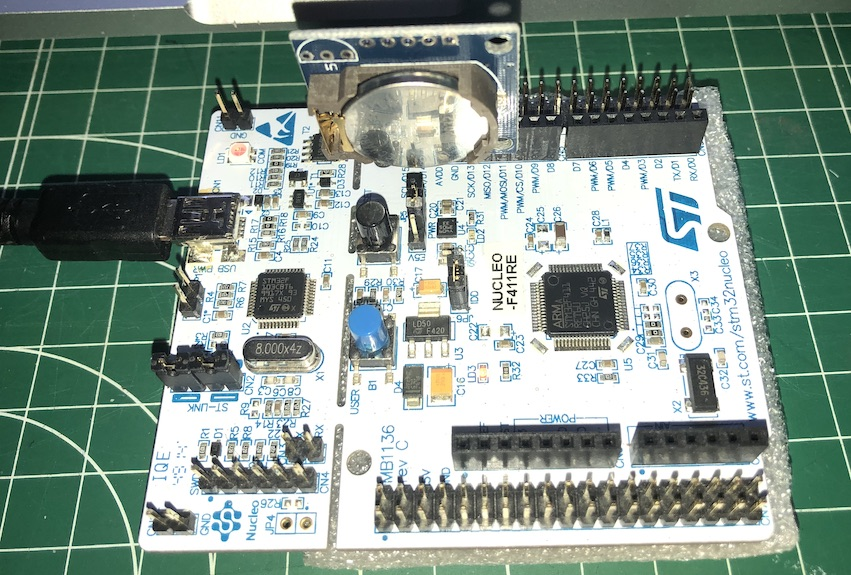

# RTC DS1307 Shell

## About
This simple application is a shelle for setting and getting the real time from a DS1307 component.

## Wiring
The DS1307 breakout should connected to the Nucleo according the wiring :

        DS1307  --  Nucleo
        VCC     --  5V or AVDD
        GND     --  GND
        SDA     --  SDA/D14
        SCL     --  SCL/D15

## Configuration
It uses the default device parameters as specified in
`drivers/ds1307/include/ds1307_params.h`. To override these setting, you
can simply do this by defining these parameters as compiler flags while building,
e.g.:
```
$ CFLAGS="-DDS1307_PARAM_I2C=I2C_DEV(1)" make all
```

# Usage
Simply flash this example to your board and type `help`

```bash
RIOT DS1307 RTC Shell
> help           
Command              Description
set_rtc              Set the DS1307 RTC time                                 
get_rtc              Get the DS1307 RTC time                                      
RTC time :   2010-09-22 15:10:42
> set_rtc 2020 4 9 16 5 0
RTC time :   2020-04-09 16:05:00
> get_rtc
RTC time :   2020-04-09 16:05:18
```



## Extra
* http://fritzing.org/projects/rtc-ds1307
* http://fritzing.org/media/fritzing-repo/projects/r/rtc-ds1307/fritzing/RTC_Finale_MEGA.fzz